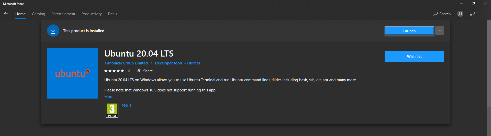

# Installing Ubuntu 20.04 on your Windows 10 machine

These instructions have been lifted from the official Microsoft documentation here:

https://docs.microsoft.com/en-us/windows/wsl/install-win10

I've just cut it down to the bare essentials for what you need to install Ubuntu 20.04 LTS on your machines.

If you are having issues with the installation, please check the [Troubleshoot installation](https://docs.microsoft.com/en-us/windows/wsl/install-win10#troubleshooting-installation) section of the original instructions to check for common issues.

## Step 1

You must first enable the "Windows Subsystem for Linux" optional feature before installing any Linux distributions on Windows.

Open PowerShell as Administrator and run:

```powershell
dism.exe /online /enable-feature /featurename:Microsoft-Windows-Subsystem-Linux /all /norestart
```

## Step 2

To update to WSL 2, you must be running Windows 10.

- For x64 systems: Version 1903 or higher, with Build 18362 or higher.
- For ARM64 systems: Version 2004 or higher, with Build 19041 or higher.
- Builds lower than 18362 do not support WSL 2. Use the Windows Update Assistant to update your version of Windows.

To check your version and build number, select Windows logo key + R, type winver, select OK. (Or enter the ver command in Windows Command Prompt). Update to the latest Windows version in the Settings menu.

## Step 3

Before installing WSL 2, you must enable the Virtual Machine Platform optional feature. Your machine will require virtualization capabilities to use this feature.

Open PowerShell as Administrator and run:

```powershell
dism.exe /online /enable-feature /featurename:VirtualMachinePlatform /all /norestart
```

Restart your machine to complete the WSL install and update to WSL 2.

## Step 4

Run the following command on Powershell/Command Prompt to find out whether you're on an x64 or ARM64 machine:

```powershell
systeminfo | find "System Type"
```

If you're on an x64 machine (most likely), download this Linux kernel: https://wslstorestorage.blob.core.windows.net/wslblob/wsl_update_x64.msi

If you're using an ARM64 machine, download this Linux kernel: https://wslstorestorage.blob.core.windows.net/wslblob/wsl_update_arm64.msi

Run the update package you downloaded. (Double-click to run - you will be prompted for elevated permissions, select ‘yes’ to approve this installation.)

Once the installation is complete, move on to the next step - setting WSL 2 as your default version when installing new Linux distributions.

## Step 5

Open PowerShell and run this command to set WSL 2 as the default version when installing a new Linux distribution:

```powershell
wsl --set-default-version 2
```

## Step 6

Go to this link to download Ubuntu 20.04 LTS from the Microsoft Store: https://www.microsoft.com/store/apps/9n6svws3rx71

Install it by clicking the 'Get' button on the page.



Once installed, either click on 'Launch' to start the Ubuntu 20.04 distribution or search for 'ubuntu' from the Start menu.

A terminal will pop up, prompting you to enter a username and password. This can be whatever you like, just make sure you remember what they are!

